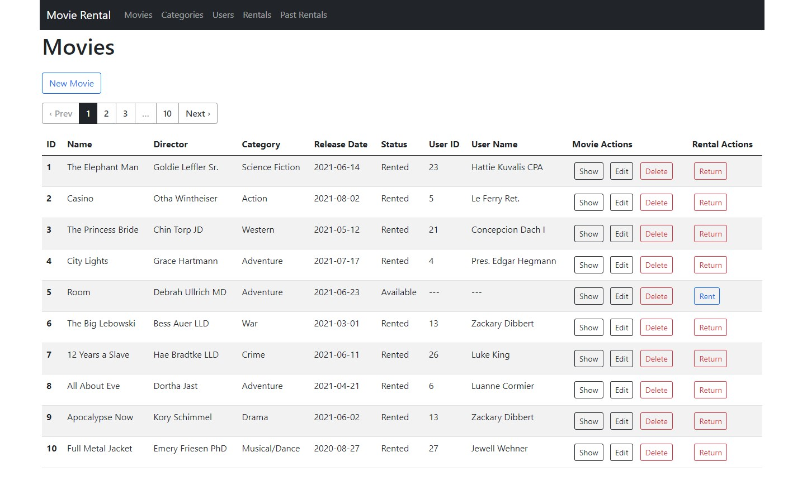

# movie-rental-app

movie-rental-app is a web application designed and built in order to manage movies, users and rentals in a movie rental.

In order to get the app up and running you first need to install some programs in your computer.

This app was developed using the following programs and versions:
- Ubuntu Linux 20.04
- Ruby 3.0.1
- Rails 6.1.4
- Bundler version 2.2.19
- psql (PostgreSQL) 12.7
- git version 2.25.1

After you have these programs installed you follow this steps in the terminal:
- Clone the repository from GitHub: git clone git@github.com:adonai-luque/movie-rental-app.git
- Enter the application folder: cd movie-rental-app
- Install the dependencies with Bundler: bundle install
- Start your psql service: sudo service postgresql start
- Create the databases: rails db:create
- Run the migrations: rails db:migrate
- Seed the database: rails db:seed
- Start the server: rails server
- Open your server in the browser. Generally is located at: http://127.0.0.1:3000/
- You should see a page similar to this, showing the Movies resource:

- From there you will be able to perform CRUD operations on the models.
- Actions in Movies Page:
  You can Create, Show details of, Edit and Delete a Movie
  For a specific Movie you can create a Rental, you'll be redirected to a form to enter a User ID
- Actions in Categories Page:
  You can Create, Show details of, Edit and Delete a Category.
- Actions in Users Page:
  You can Create, Show details of, Edit and Delete a User
  For a specific User you can create a Rental, you'll be redirected to a form to enter a Movie ID
- Actions in Rentals Page:
  You can Create, Edit and End a Rental
- Actions in Past Rentals Page:
  You can browse the Past Rentals
- In every action that requires the user to input data there are validations that prevent forbidden behaviour e.g. :
  All fields are mandatory in the creation of a new record of any model.
  You can't create a movie with an invalid category.
  You can't return a movie that is available.
  You can't rent a movie that is already rented.
  You can't create a user with an email that is already taken.
  You can't perform CRUD operations other than Read on Past Rentals, they are automatically created when a rental ends.
- When you perform a creation, edition or deletion there will be a notice that will inform you of the result of your request

- There is an online version of this app deployed on Heroku at: https://adonai-luque-movie-rental-app.herokuapp.com/
